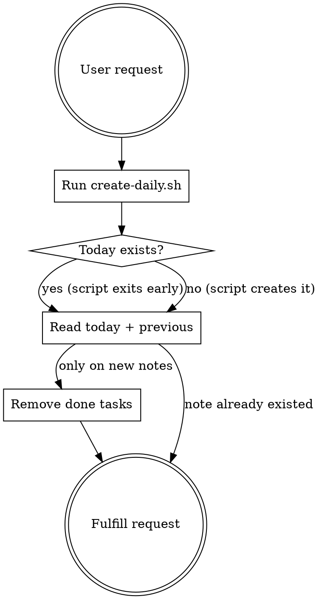

# Daily Note

Manage daily notes in an Obsidian vault. Creates today's note with migrated tasks from the most recent previous note, then fulfills the user's request.

## Flow



### Step 1: Run the script

```bash
~/.config/claude/skills/managing-daily-notes/create-daily.sh ~/notes
```

Output (two lines, parse both):
```
today:/home/micha/notes/notes/dailies/2026-02-08.md
previous:/home/micha/notes/notes/dailies/2026-02-07.md
```

### Step 2: Read both notes

- **Today's note**: the note to work with
- **Previous note**: read for context (understand what the user was doing recently)

### Step 3: Clean up migrated tasks (only if the script created a new note)

The script copies ALL checkbox lines from the previous note. Remove lines matching `- [x]` (done). Keep everything else:

| Syntax | Meaning | Action |
|--------|---------|--------|
| `- [ ]` | Open | Keep |
| `- [~]` | In progress | Keep |
| `- [!]` | Important | Keep |
| `- [>]` | Deferred | Keep |
| `- [x]` | Done | **Remove** |

### Step 4: Fulfill the user's request

Add content, update tasks, or whatever was asked. Match the language of the user's request — technical notes are typically English, personal notes often German.

## Note Format

```markdown
---
id: "YYYY-MM-DD"
aliases:
  - Month DD, YYYY
tags:
  - daily-notes
---

# Month DD, YYYY
```

Frontmatter fields: `id` (date string), `aliases` (English long-form date), `tags` (always includes `daily-notes`). Heading matches the alias.
